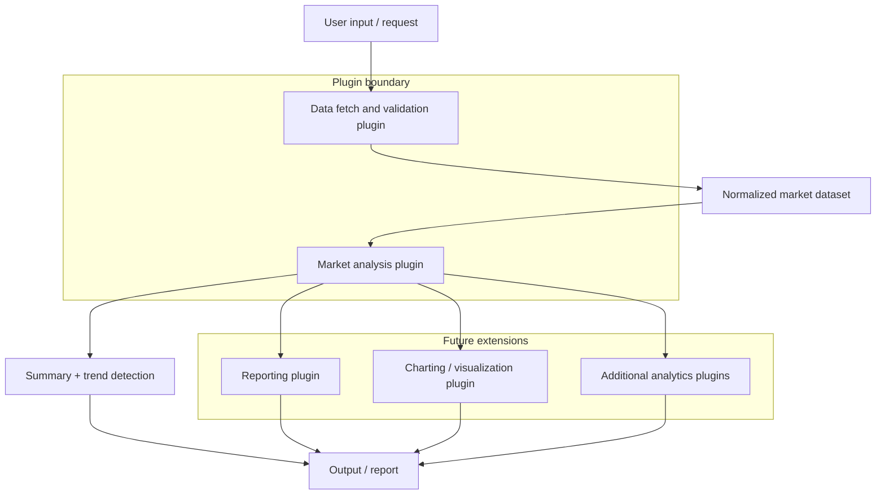

# Plugin Architecture Diagram

## Notes
- The Data Processing plugin is responsible for ingesting, validating, and shaping raw market data.
- The Market Analysis plugin focuses on insight generation such as summaries and trend detection.
- Additional plugins can be attached later for reporting, visualization, or specialized analytics without changing the core flow.
